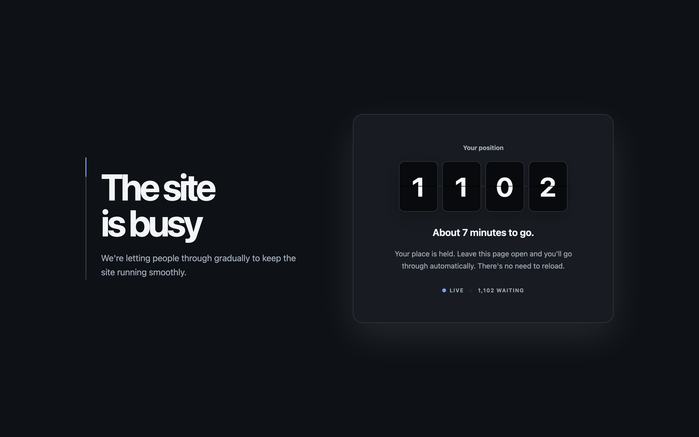
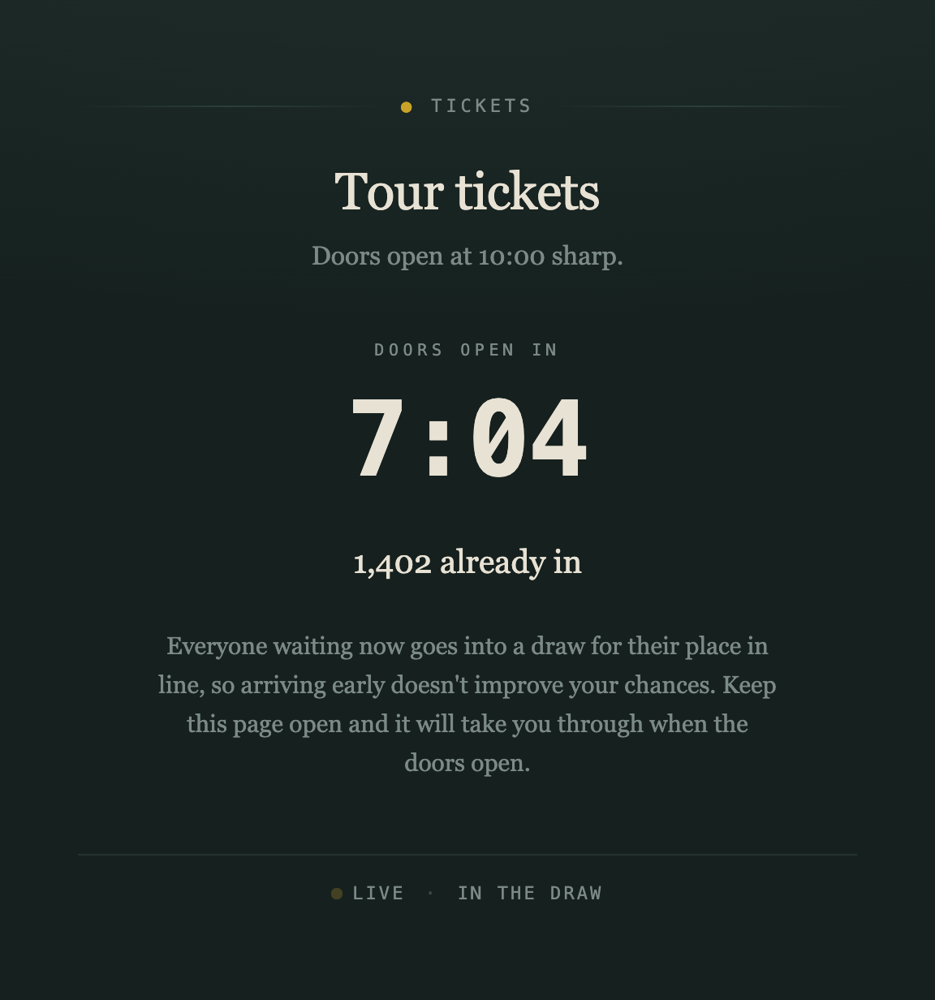
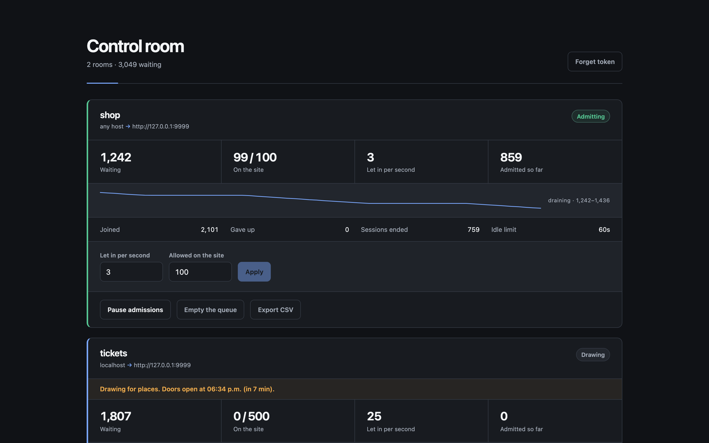

# anteroom

[](https://github.com/rsendz/anteroom/actions/workflows/ci.yml)
[](https://pkg.go.dev/github.com/rsendz/anteroom)
[](LICENSE)

A self-hosted virtual waiting room. Put it in front of a page that's about to
get more traffic than it can take, and instead of the page falling over,
visitors see a fair queue with their position and are let through at a rate the
site can actually handle.

<p align="center">
  
</p>

```
visitors ──▶ anteroom ──▶ your site
                │
                └─▶ waiting page: position, estimated wait, live updates
```

Anteroom is a reverse proxy, so the site behind it needs no changes at all —
no SDK, no middleware, no code.

The number on the board physically turns over as the queue moves. That is the
whole reason it is there: a visitor who can see the line advancing doesn't
reach for reload, and reloading is the traffic anteroom exists to absorb.

## Try it

```sh
docker compose -f deploy/docker-compose.yml up --build
```

Open <http://localhost:8080>. The demo admits one visitor every two seconds
with a limit of three on the site at once, so you can watch the queue work.
Open a second browser (or a private window) to get in line behind yourself.

The control room is at <http://localhost:8080/__anteroom/admin/> — the demo
token is `demo-admin-token`.

## Install

```sh
go install github.com/rsendz/anteroom/cmd/anteroom@latest
```

That builds without the front-end assets, so anteroom serves a plain waiting
page that shows the position and refreshes itself, and the control room falls
back to its API. It is a real waiting room, just not the animated one.

For the split-flap board and the dashboard, build the front-end in:

```sh
git clone https://github.com/rsendz/anteroom && cd anteroom
make build       # front-end, then bin/anteroom
```

Or run the image, which has both built in:

```sh
docker build -f deploy/Dockerfile --target anteroom -t anteroom .
```

`anteroom --version` reports which build you have.

## Put it in front of your own site

One command, no configuration:

```sh
anteroom --origin http://localhost:3000 --rate 50
```

Then send traffic to anteroom instead of your site. It prints an admin token
on startup for the dashboard.

For anything you intend to keep running, start from a config file:

```sh
anteroom init > anteroom.yaml   # writes a commented config with fresh secrets
anteroom --config anteroom.yaml
```

Set `ANTEROOM_COOKIE_SECRET` (or `cookie_secret`) to a stable value. It signs
the cookie that remembers a visitor's place, so changing it sends everyone to
the back of the queue.

## How admission works

A visitor is let through only when **both** limits allow it:

- **Rate** — a token bucket admits `rate` visitors per second. Burst is capped
  at one second's worth, so a pause or an outage can't dump the queue on your
  origin all at once.
- **Concurrency** — at most `max_active` visitors may be on the site at any
  time. A session is reclaimed after `session_ttl` without a request, and its
  slot goes to the next person in line.

Both are adjustable while running, from the dashboard or the API, and take
effect on the next admission pass (250 ms by default).

The queue is strict FIFO, ordered by a Redis counter, and admission runs as a
single atomic Lua script. Several anteroom replicas can share one Redis and
still enforce one fair queue and one global rate.

**Abandonment.** A waiting page sends a heartbeat while it's open. A visitor
who closes the tab stops sending it, and after `abandon_after` they're dropped
from the queue so they aren't holding up the people behind them. If they come
back, they rejoin at the end.

**Bot resistance.** Each address may add only so many visitors to the queue per
minute (`join_limit_per_ip`, 120 by default), which stops a script taking
thousands of places. Anyone over the limit gets a 429. Keep it generous —
office and mobile networks put many real people behind one address — and watch
`total_refused` on the dashboard, which is the signal that it's too tight.

If anteroom runs behind a load balancer you **must** list it in
`trusted_proxies`, or `X-Forwarded-For` is ignored, every visitor looks like
the balancer, and they all share one budget. See
[docs/production.md](docs/production.md).

## Scheduled drops

For a sale that starts at a fixed time, a room can open on a schedule:

```yaml
rooms:
  tickets:
    origin: http://tickets-app:4000
    lottery: true
    schedule:
      queue_opens_at: 2026-11-20T09:30:00Z   # people may start lining up
      admits_at:      2026-11-20T10:00:00Z   # doors open
      closes_at:      2026-11-20T12:00:00Z   # optional
```

Before `queue_opens_at` nobody is queued at all. Between then and `admits_at`
visitors are collected but nobody is let in. After `closes_at` no new
admissions happen, though visitors already on the site keep their sessions.

With `lottery: true`, everyone collected before the doors open gets a place
drawn from their identity rather than their arrival time, **so turning up early
gains nothing**. The place is derived by hashing, not randomly assigned, which
means leaving and rejoining lands on the same number — there's no point
rerolling. Anyone arriving after the doors open queues behind the whole draw.

During the draw the page shows a countdown and how many have entered, not a
position: a position would either shuffle as others join (which reads as
broken) or reward whoever refreshed earliest.

<p align="center">
  
</p>

## Rooms

One anteroom can protect several sites, chosen by hostname:

```yaml
rooms:
  shop:
    match_host: shop.example.com
    origin: http://shop-backend:3000
    rate: 50
    max_active: 500

  tickets:
    match_host: tickets.example.com
    origin: http://tickets-app:4000
    rate: 10
    max_active: 100
```

A room with no `match_host` is the catch-all for any host that doesn't match a
more specific room. At most one room can be the catch-all. Each room has its
own queue, rate, cap, and counters; nothing crosses between them.

## The waiting page

Server-rendered, then updated over Server-Sent Events — one Redis read per
waiting visitor every two seconds, no matter how impatient they are. If the
stream drops, the page falls back to reloading itself on a jittered timer so a
crowd doesn't return in lockstep. With no JavaScript at all, a `meta refresh`
keeps it moving.

`title` and `message` on the room set what it says.

## Events

Anteroom publishes what it does to Kafka: `visitor_joined`,
`visitor_admitted`, `visitor_abandoned`, `session_expired`, `config_changed`.

```json
{"type":"visitor_admitted","room":"shop","visitor_id":"9f2c…","ts":"2026-09-04T09:15:02.113Z"}
```

This is strictly a side channel. Publishing never blocks an admission or a page
load, events are dropped (with a log line) rather than allowed to back up, and
anteroom runs exactly the same with `kafka.brokers` empty or the broker down.
Try `docker compose stop kafka` against the demo and watch the queue carry on.

## The control room

Every room's counters, a sparkline of queue depth, and the controls that matter
during an incident — rate, concurrency, pause, and emptying the queue — at
`/__anteroom/admin/`. Changes take effect on the next admission pass, without a
restart.

<p align="center">
  
</p>

## Admin API

All endpoints need `Authorization: Bearer <admin_token>`.

| Method | Path | Does |
| --- | --- | --- |
| `GET` | `/__anteroom/admin/api/status` | Queue health; answers even when Redis is down |
| `GET` | `/__anteroom/admin/api/rooms` | Every room with its counters |
| `GET` | `/__anteroom/admin/api/rooms/{room}/stats` | One room's counters |
| `PUT` | `/__anteroom/admin/api/rooms/{room}/config` | Change `rate`, `max_active`, `session_ttl_secs`, `abandon_after_secs` |
| `POST` | `/__anteroom/admin/api/rooms/{room}/pause` | Hold everyone where they are |
| `POST` | `/__anteroom/admin/api/rooms/{room}/resume` | Start admitting again |
| `POST` | `/__anteroom/admin/api/rooms/{room}/flush` | Empty the queue (sessions on the site are left alone) |

```sh
curl -X PUT -H "Authorization: Bearer $TOKEN" \
     -H 'Content-Type: application/json' \
     -d '{"rate": 100}' \
     http://localhost:8080/__anteroom/admin/api/rooms/shop/config
```

`GET /__anteroom/healthz` needs no token.

Runtime settings live in Redis, not the config file, so a change you make here
survives a restart. Anteroom logs a warning when the live values differ from
the file; start it with `--reseed` to make the file win.

## Notes

- Anteroom reserves the URL prefix `/__anteroom/` for itself. Nothing under it
  is ever proxied. Everything else belongs to your site.
- **If Redis is unreachable, nobody is admitted.** Waiting visitors are held on
  the page and let in when it recovers — no restart needed. Waving everyone
  through would hand your origin the exact spike anteroom is there to prevent.
  If you'd rather serve the site unprotected than serve nobody, set
  `fail_open: true`; anteroom then proxies everyone through, but only after
  the queue has been unreachable for `fail_open_after` (30s by default), and it
  says so loudly in the logs and on the dashboard while it does.
- Anteroom does not terminate TLS. Run it behind your load balancer and set
  `secure_cookies: true`. See [docs/production.md](docs/production.md) for
  nginx and ALB configuration, Redis persistence, and sizing.
- `preserve_host: true` on a room forwards the visitor's `Host` to the origin,
  for backends that serve several virtual hosts.

## Building

The front-end is embedded in the binary, so it's built first:

```sh
make build     # front-end, then the Go binary, into bin/anteroom
make test      # go test ./... -race
make check     # tests, vet, gofmt, and the front-end type-check and tests
```

`make check` is what CI runs, so a green run locally means a green run there.

`go build ./cmd/anteroom` on its own works too — without the front-end assets
it serves a plain waiting page that still shows the position and refreshes
itself.

## Layout

| Path | What's in it |
| --- | --- |
| `internal/queue` | Redis data model and the Lua admission script — the correctness core |
| `internal/admit` | The background loop that runs admissions |
| `internal/httpserver` | Routing, the proxy, the waiting page, SSE, the admin API |
| `internal/token` | The signed visitor cookie |
| `internal/events` | The Kafka publisher |
| `web/` | Waiting page (vanilla TS) and control room (React), built by Vite |

## Not included

Metrics export (the room snapshot is the natural place to add it), TLS,
path-based room matching, and any client SDK — anteroom is a proxy on purpose.

## License

MIT — see [LICENSE](LICENSE).
